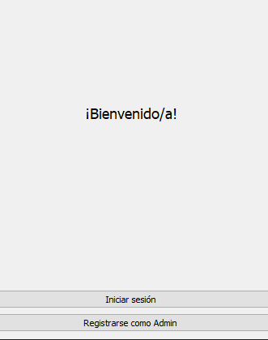
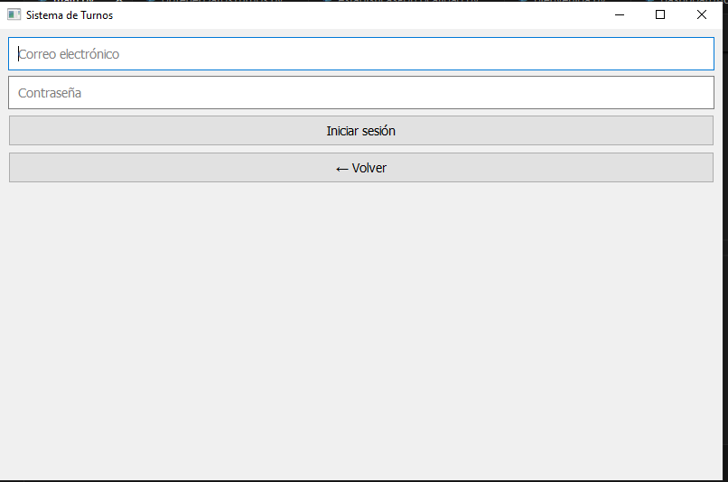
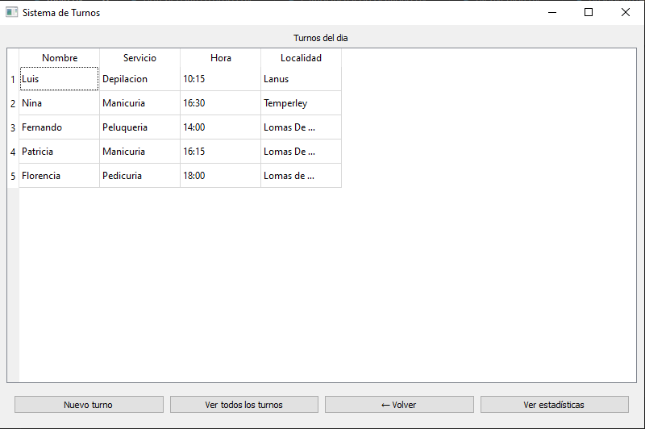
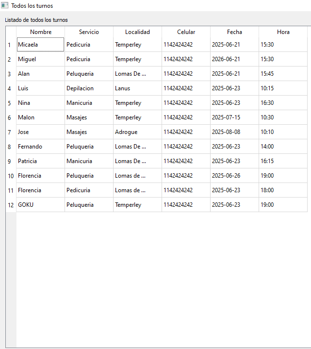
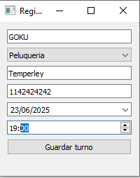
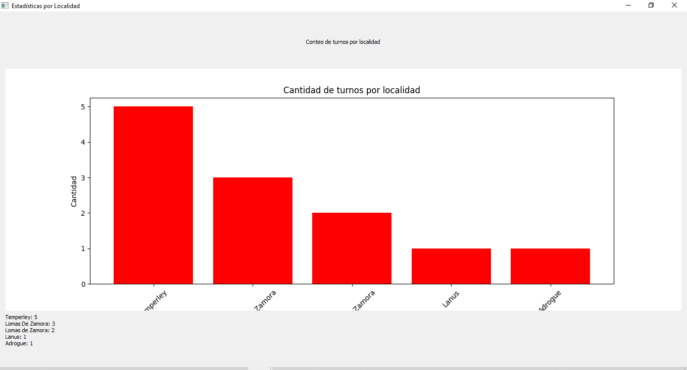

<h1 align="center">
  App Turnos Estética
</h1>

  Aplicación de escritorio para gestión de turnos, usuarios y estadísticas en una estética o centro de servicios.

---

---

## 📦 Tecnologías utilizadas

- **Lenguaje:** Python 3.x  
- **Interfaz gráfica:** PyQt5  
- **Base de datos:** SQLite3  
- **Análisis y gráficos:** Pandas, Matplotlib  
- **Seguridad:** Bcrypt para hashing de contraseñas

## 🧱 Patrones de Diseño 

**Este proyecto utiliza los siguientes patrones de diseño para mantener un código organizado, escalable y fácil de mantener:**

### Modelo-Vista-Controlador (MVC)**
- ***Modelo: Contiene las clases y funciones - relacionadas con la lógica de negocio y acceso a datos (por ejemplo, la conexión a la base de datos y las operaciones SQL).***

- ***Vista: Son las interfaces gráficas (widgets de PyQt5) con las que el usuario interactúa.***

- ***Controlador: Maneja la lógica que conecta el Modelo y la Vista, gestiona los eventos de usuario, las transiciones entre pantallas y llama a funciones del modelo para obtener o modificar datos.***

**Este patrón ayuda a separar responsabilidades y facilita el mantenimiento.**

## Factory Method ##
**Para la creación de objetos, especialmente en el manejo de turnos, se implementa un Factory Method que:**

- ***Centraliza la creación y normalización de objetos Turno.***

- ***Evita repetir lógica de limpieza y formateo de datos en varios lugares.***

- ***Facilita cambios futuros en la forma en que se crean los turnos.***
--- 

## Flujo de los archivos

***nuevoProyectoPyqtTurnos/
├── main.py
├── models/
│   ├── conectarBase.py
│   ├── crearTablaTurnos.py
│   ├── crearTablaUsuarios.py
│   ├── insertarTurno.py
│   ├── insertarUsuario.py
│   ├── turno.py
|   ├── turnoFactory.py
|   ├── turnoFactory.py
|   ├── verificarCredenciales.py
|   └──...
├── controladores/
│   ├── abrirLogin.py
│   ├── registrar.py
│   └── ...
├── vistas/
│   ├── bienvenida.py
│   ├── dashboardAdmin.py
│   ├── estadisticasPorLocalidad.py
│   ├── formTurno.py
│   ├── loginWindow.py
|   ├── mainWindow.py
|   ├── registroAdmin.py
|   ├── todosLosTurnos.py
|   └──...
└── requirements.txt***

***CAPTURAS DE LA APP EN FUNCIONAMIENTO***

### Capturas de pantalla

#### Pantalla de Bienvenida

#### Formulario de Login

#### Panel de Administrador

#### Panel de Todos los turnos

#### Panel para sacar turnos

#### Estadisticas de todos los turnos por localidad

